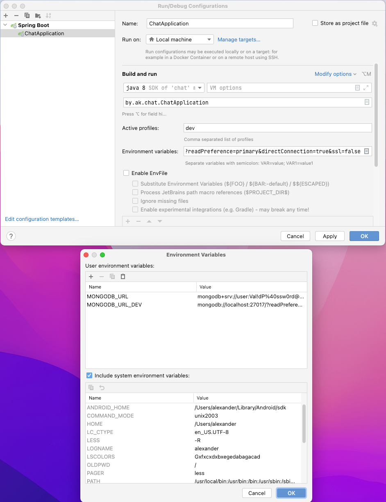

Chat application.

Features:
* sign in/sign up
* chat messaging
* message wrapping if it exceeds the width of the screen
* date/time view in accordance with the time zone of the user
* chat history automatic backup to cloud db
* chat messages markdown support
* in chat notifications about user presence (joined/left. latter alse depends on user being logged out by timeout)
* chat rooms
* chat rooms creation
* user management for administrators (filtering)
* toggle for dark / light theme

# Prerequisites
[JDK 17](https://jdk.java.net/17/)

For Heroku deployment **current target version set to 8**:

[Java 8](https://jdk.java.net/java-se-ri/8-MR3)

node **16.13.0** (LTS): [Win](https://nodejs.org/dist/v16.13.0/node-v16.13.0-x86.msi)
[Linux](https://nodejs.org/dist/v16.13.0/node-v16.13.0.tar.gz)
[Macos](https://nodejs.org/dist/v16.13.0/node-v16.13.0.pkg)

## Running the application
```bash
./gradlew bootRun --args='--spring.profiles.active=dev'
```

## Deploy to production
```bash
 ./mvnw install -P production     
```

For connection to MongoDB locally just install it.
```bash
brew install mongodb-community
brew services start mongodb-community
```
Environment variables should be like:
```bash
MONGODB_URL_DEV mongodb://localhost:27017/?readPreference=primary&directConnection=true&ssl=false
MONGODB_URL mongodb://localhost:27017/?readPreference=primary&directConnection=true&ssl=false
```

If you use IDE like IntelliJ IDEA you can configure run like this:


**Note:** The application is running on port 8080. And could be accessed by http://localhost:8080/

It takes time to start the application as Vaadin initializes frontend and downloads necessary libs.

Links:

[Markdown support](https://github.com/rjeschke/txtmark)

[Vaadin](https://vaadin.com/)

[Heroku build pack](https://github.com/heroku/heroku-buildpack-java#customize-maven)
